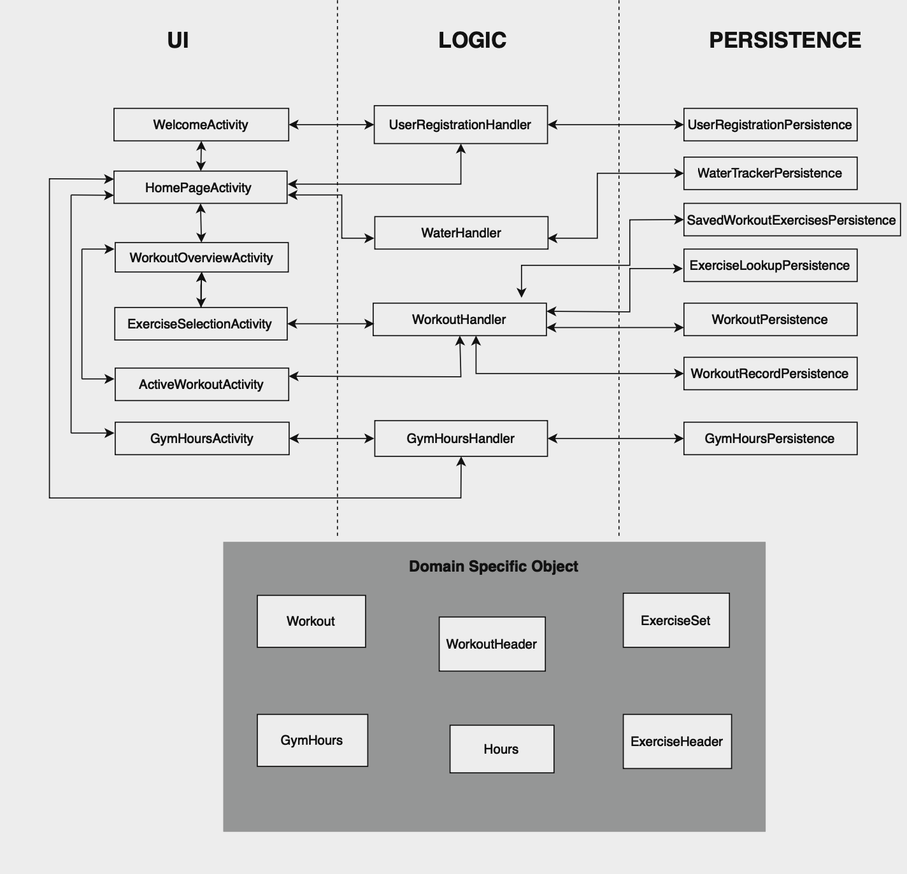

# ARCHITECTURE

<b><i>
This document outlines the underlying architecure of BisonFit.
</i></b>

## Three+ layer apprach

#### 1. UI Layer
The _UI Layer_ contains the Java file required for each Activity, and any XML files required. The Java file performs no logic, but only handles events, updates the UI, and makes calls to the _Logic Layer_. All the Activity files are located in:

`app/src/main/java/funkyflamingos/bisonfit/ui` 

All the XML files are located in: 

`app/src/main/res/layout`

#### 2. Logic Layer
The _Logic Layer_ represents the connection between the _UI Layer_ and the _Persistence Layer_. It consists of Java classes. The _UI Layer_ handles an event, communicated to the _Logic Layer_, which processes the request, makes calls to the _Persitence Layer_, recieves data from the _Persistence Layer_, and communicates back to the _UI Layer_.	The _Logic Layer_ does not directly change the UI, and does not directly access the Databases. The Java files for the _Logic Layer_ are located in: 

`app/src/main/java/funkyflamingos/bisonfit/logic` 

#### 3. Persistence Layer 
The _Persistence Layer_ is responsible for persisting data storage of the app. It recieves calls from the _Logic Layer_, processes the calls, manipulates the Databases through SQL, and returns data back to the _Logic Layer_. It consists of Java classes, and is the only layer that can make SQL queries. The _Persistence Layer_ Java files are located in:

`app/src/main/java/funkyflamingos/bisonfit/persistence`

#### + DSO
The _Domain Specific Object (DSO)_ does not represents a layer per se., but describes the objects that represent and group data that is passed around between layers. The _Persistence Layer_ retrieves data from the Database, creates an instance of a _DSO_, and passed it to the _Logic Layer_. The _Logic Layer_ performs some logical operations on the _DSO_, and passes it to the _UI Layer_, which displays it. The same chain of calls is made in reverse order. The _Objects_ are instances of Java classes, located in:

`app/src/main/java/funkyflamingos/bisonfit/objects`

### Iteration 1 Diagram

### Iteration 2 Diagram

## Database tables
The following are the SQL tables that are required. Underlined attributes make up the primary key. Tables with same attribute names represent data of same category, linked according to the values of common attributes.

#### Static Lookup Tables:
Tables not meant to be changed by the user.

**EXERCISELOOKUP** 
|Attribute|Type|Description|
|-|-|-|
|<ins>ID<ins>|`int`|Unique exercise identifier
|NAME|`varchar`|Display name of exercise
|TYPE|`int`|`0` for weight exercise, `1` for other (eg.running)

**GYMHOURS** 
|Attribute|Type|Description|
|-|-|-|
|<ins>dayWeek<ins>|`int`|Unique integer corresponding to a day of the week
|openingTimeHour|`int`|The hour the gym opens
|openingTimeMin|`int`|The minute the gym opens
|openingTimeSec|`int`|The second the gym opens
|closingTimeHour|`int`|The hour the gym closes
|closingTimeMin|`int`|The minute the gym closes
|closingTimeSec|`int`|The second the gym closes

#### Saved Workouts Tables:
Tables that contain the workouts that have been created and saved by the user or exist by deafult.  
**WORKOUTS** 
|Attribute|Type|Description|
|-|-|-|
|<ins>ID</ins>|`int`|Unique workout identifier
|TITLE|`varchar`|Display name of workout

**SAVEDWORKOUTEXERCISES** 
|Attribute|Type|Description|
|-|-|-|
|<ins>WORKOUTID</ins>|`int`|Identifier of workout to which this exercise belongs|
|<ins>EXERCISEID</ins>|`int`|Identifier of exercise
|<ins>INDEX</ins>|`int`|The position of this exercise in this workout
|NUMSETS|`int`|The number of sets performed for an exercise

#### Workout Record Tables:
Tables that hold the record of workouts and exercises done by the user.  

**PERFORMEDWORKOUTRECORD** 
|Attribute|Type|Description|
|-|-|-|
|<ins>WORKOUTRECORDID</ins>|`int`|Unique identifier of performed workout|
|TITLE|`varchar`|Title of workout performed
|START|`varchar`|Represents the start date and time of the workout
|END|`varchar`|Represents the end date and time of the workout

**PERFORMEDEXERCISERECORD** 
|Attribute|Type|Description|
|-|-|-|
|<ins>WORKOUTRECORDID</ins>|`int`|Identifier of performed workout
|<ins>INDEX</ins>|`int`|The position of exercise in performed workout
|EXERCISEID|`int`|Identifier of exercise
|WEIGHT|`int`|The weight in lbs performed in this set, `-1` if not required
|REPS|`int`|The number of repitions performed in this set, `-1` if not required
|SETIDENTIFIER|`int`| Determines which exercise a specific exercise set belongs to in a performed workout

#### Water Tracking Table:
Table that holds data on daily water drinking goal progress.
**WATERTRACKING** 
|Attribute|Type|Description|
|-|-|-|
|<ins>dateProgress<ins>|`varchar`|Unix time stamp at 12:00AM of day in reference|
|cupsDrank|`int`|The number of cups drank this day

#### User Registration Table:
Table that holds data on the registered user
**USERREGISTRATION** 
|Attribute|Type|Description|
|-|-|-|
|<ins>userName<ins>|`varchar`|The name of the registered user|

