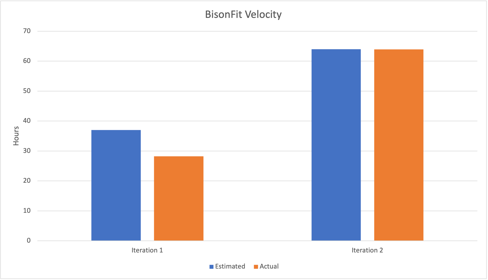

# Retrospective

## Discussion

After our group meeting, we took the time to review the progress we've made so far, and overall, we were pleased with how things have been going. The group dynamics have been really positive, and we genuinely enjoyed working together, thanks to our good communication. However, we did identify some areas where we could improve in the upcoming iteration, which is the third one.

The main challenge we faced during the project was time management, especially in the second iteration. Our desire to add many features during this phase led us to take on too much at once, leaving us with limited time for thorough testing and code review. Although we managed to conduct some testing, we felt rushed, and as a result, we couldn't carefully examine the code for potential problems. Leaving some code to be completed just a day before the deadline also left us with little time to review and perform adequate testing, which might have caused us to overlook important details while working on the project. Additionally, dealing with multiple features and our busy schedules with other classes added a lot of stress to the process. It wasn't uncommon for us to have to wait for one person to finish their part of the code before the next person could continue, causing significant delays in our progress.

Looking ahead to the final iteration, we have set some specific points to evaluate our success. Firstly, our plan is to focus on achieving at least two essential features, which is the minimum requirement for the project. By doing this, we hope to finish the code earlier and have more days to ensure that all the code meets our desired standards and has good test coverage. This approach will help us avoid unnecessary stress by not overburdening ourselves with more work than we can handle. To further enhance our productivity, we have decided to separate the work better, giving each team member enough time to complete their tasks. This will enable us to work more efficiently and reduce delays caused by dependencies. By making these necessary improvements, we are confident that the final phase of the project will be even more successful and productive.

## Project Velocity

During our team's discussion, one important topic was analyzing the velocity from iteration 1 and iteration 2 to make more accurate predictions for the dev tasks in iteration 3. In the initial iteration, we overestimated our work because it was our first time using Android Studio. We wanted to ensure we had extra time to set up the environment and plan the entire project. However, after completing the first sprint, we gained valuable insights and were able to plan more effectively in iteration 2. We identified how much we could realistically accomplish and used the same approach to plan for iteration 3, leveraging our improved understanding. 
